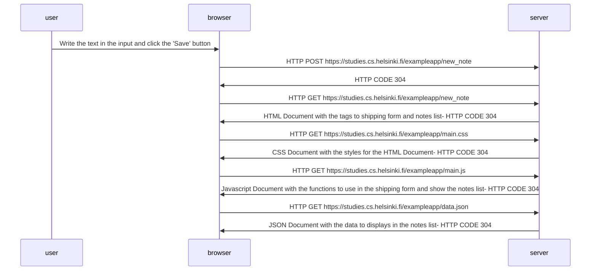

## Sequence Diagram of New Note on the Example App - Exercise 0.4

```mermaid
sequenceDiagram
    participant user
    participant browser
    participant server

    user->>browser: Write the text in the input and click the 'Save' button 
    browser->>server: HTTP POST https://studies.cs.helsinki.fi/exampleapp/new_note
    server->>browser: HTTP CODE 304

    browser->>server: HTTP GET https://studies.cs.helsinki.fi/exampleapp/new_note
    server->>browser: HTML Document with the tags to shipping form and notes list- HTTP CODE 304

    browser->>server: HTTP GET https://studies.cs.helsinki.fi/exampleapp/main.css
    server->>browser: CSS Document with the styles for the HTML Document- HTTP CODE 304

    browser->>server: HTTP GET https://studies.cs.helsinki.fi/exampleapp/main.js
    server->>browser: Javascript Document with the functions to use in the shipping form and show the notes list- HTTP CODE 304

    browser->>server: HTTP GET https://studies.cs.helsinki.fi/exampleapp/data.json
    server->>browser: JSON Document with the data to displays in the notes list- HTTP CODE 304
```