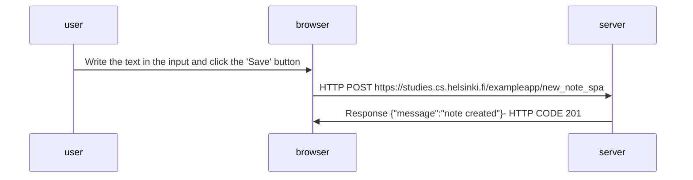

## Sequence Diagram of New Note on the Single Page Example App - Exercise 0.4

```mermaid
sequenceDiagram
    participant user
    participant browser
    participant server

    user->>browser: Write the text in the input and click the 'Save' button 
    browser->>server: HTTP POST https://studies.cs.helsinki.fi/exampleapp/new_note_spa
    server->>browser: Response {"message":"note created"}- HTTP CODE 201
```